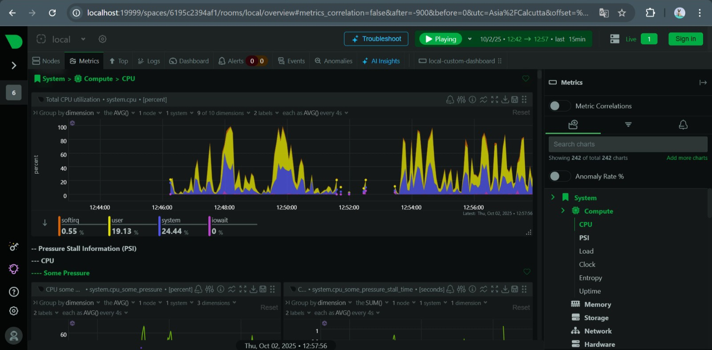

# Monitor System Resources Using Netdata with Docker

## Overview
This repository contains a task focusing on installing Netdata, a free and open-source real-time monitoring tool, and visualizing system and application performance metrics using Docker. Netdata is a zero-configuration observability platform that provides per-second metrics, AI-powered insights, and anomaly detection for infrastructure, applications, networks, and logs.

## Objective
- Install Netdata and visualize system and app performance metrics, including CPU, memory, disk usage, and Docker containers.
- Explore alerts, chart panels, and logs.
- Gain an understanding of lightweight monitoring for servers or applications.

## Tools Used
- *Netdata*: An open-source, real-time monitoring tool that collects metrics every second without sampling, offering high-resolution visibility into systems and applications.<grok-card data-id="8d1944" data-type="citation_card"></grok-card>
- *Docker*: Used to run Netdata in a container for easy deployment and isolation.

## Steps Taken
1. *Installed Docker Desktop*:
   - Downloaded and installed Docker Desktop from the official website.
   - Enabled Windows Subsystem for Linux (WSL 2) and verified installation with docker --version and docker run hello-world.

2. *Ran Netdata via Docker*:
   - bash docker-commands.sh
   - Verified the container was running using docker ps.

3. *Accessed the Dashboard*:
   - Opened http://localhost:19999 in a web browser to view the real-time dashboard.

4. *Monitored Metrics*:
   - Explored sections for CPU utilization, memory usage, disk I/O, and Docker container metrics.
   - Netdata provides 1800x more visibility with 30x more metrics per second compared to traditional tools.<grok-card data-id="d366b3" data-type="citation_card"></grok-card>

5. *Explored Alerts and Charts*:
   - Checked the alerts section for any notifications based on anomaly detection.
   - Interacted with chart panels to zoom, export, and analyze data.

6. *Viewed Logs*:
   - Used docker logs netdata to inspect Netdata's logs, simulating access to /var/log/netdata.

## 📸 Screenshots
### Dashboard Home

### System Monitoring

### Network Monitoring

### Applications / Processes

### Alerts Monitoring

### CPU Monitoring

### Disk Monitoring

### Memory Monitoring :

### Nodes Page :

### Docker Code :

## Outcome and Learnings
This task provided hands-on experience with lightweight, real-time monitoring. Netdata enables quick troubleshooting by keeping data on-premises and offering AI-driven insights, reducing downtime for servers and applications.<grok-card data-id="02eb16" data-type="citation_card"></grok-card> It emphasizes simplicity, making it suitable for lean teams managing infrastructure from bare metal to multi-cloud environments.

